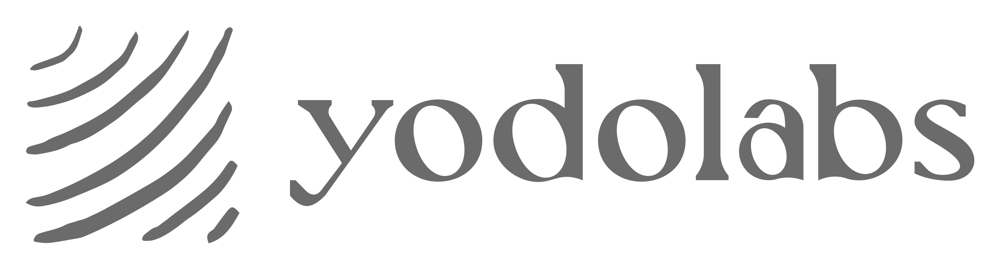
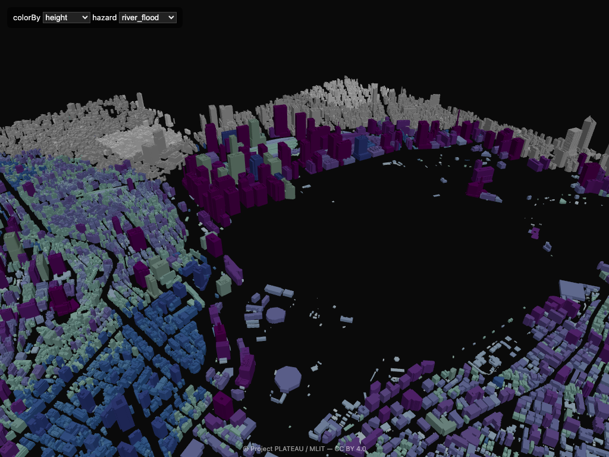
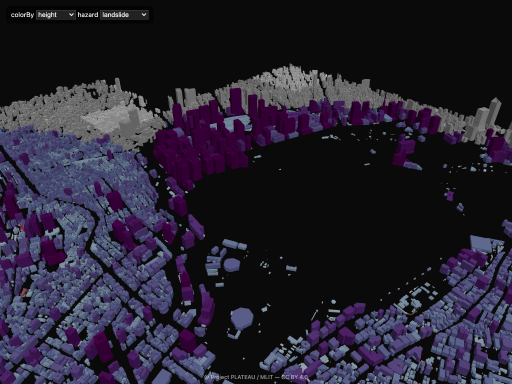
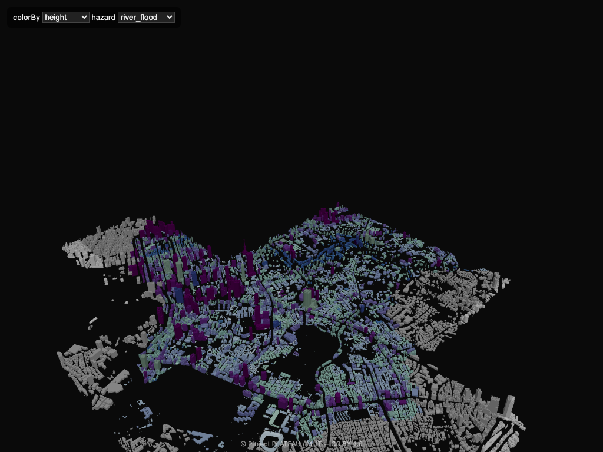
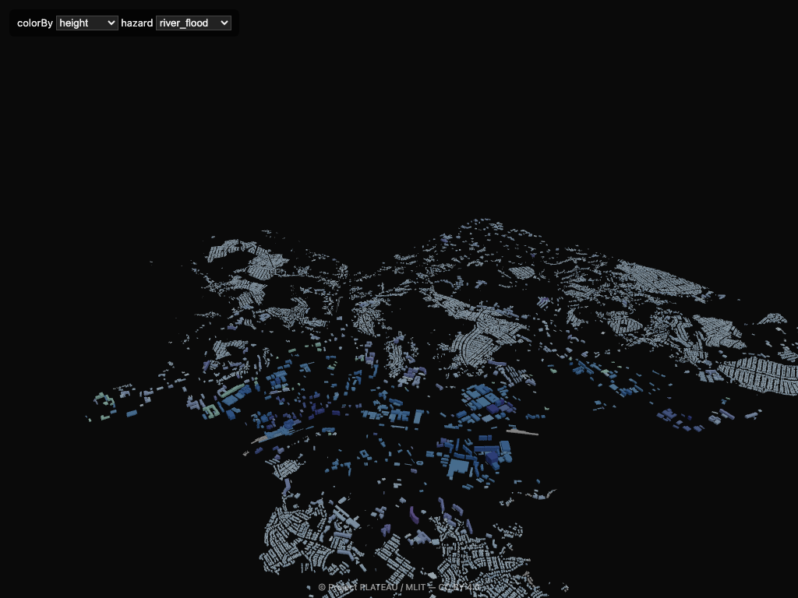
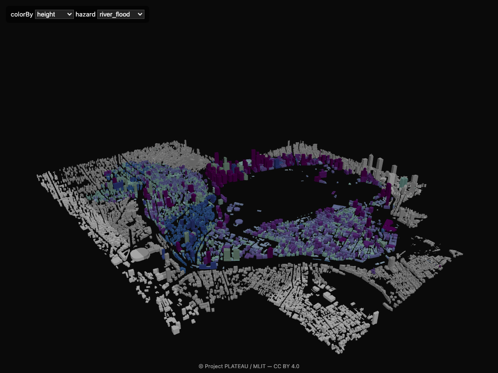

<p align="right">
  <a href="./README.md">English</a> &nbsp;·&nbsp; <a href="./README.ja.md">日本語</a>
</p>

<p align="center">
  
</p>

<h1 align="center">@plateau/r3f</h1>

<p align="center">
  <b>PLATEAU 3D Tiles for React Three Fiber.</b><br/>
  Per-building attribute coloring · 5 hazard layers · PMTiles fallback.
</p>

<p align="center">
  <a href="https://www.npmjs.com/package/@plateau/r3f"></a>
  <a href="./LICENSE"></a>
  <a href="https://github.com/pixelx-jp/plateau-r3f/actions/workflows/ci.yml"></a>
  
  
</p>

<p align="center">
  
  <br/>
  <sub>Chiyoda — <code>colorBy="height"</code> + <code>&lt;HazardLayer type="river_flood" /&gt;</code></sub>
</p>

---

## Why

Japan's [Project PLATEAU](https://www.mlit.go.jp/plateau/) ships open 3D city models for 25+ cities, but the official tooling assumes CesiumJS. This library brings PLATEAU into the Three.js / React Three Fiber world with three things the official stack doesn't give you out of the box:

1. **Per-building attribute coloring** — drive colors from `year_built`, `structure`, `height`, or hazard depths.
2. **Five hazard layers** — `river_flood`, `inland_flood`, `tsunami`, `storm_surge`, `landslide`. Composition correctly distinguishes *"no data"* from *"surveyed safe"*.
3. **Graceful fallback** — when a tile has no feature ids or fails to load styling, the runtime transparently switches to PMTiles footprint extrusion so coloring still works.

## Install

```sh
npm i @plateau/r3f three @react-three/fiber
```

## Quick start

```tsx
import { Canvas } from '@react-three/fiber';
import { OrbitControls } from '@react-three/drei';
import { Plateau, HazardLayer } from '@plateau/r3f';

export default function App() {
  return (
    <Canvas camera={{ position: [1500, 1500, 1500], near: 1, far: 1_000_000 }}>
      <ambientLight intensity={0.6} />
      <directionalLight position={[1000, 2000, 500]} intensity={1} />
      <Plateau
        city="chiyoda"
        baseUrl="https://your-cdn.example.com/plateau"
        colorBy="height"
      >
        <HazardLayer type="river_flood" opacity={0.6} />
      </Plateau>
      <OrbitControls makeDefault />
    </Canvas>
  );
}
```

`baseUrl` should point to a directory of artifacts produced by [`plateau-core`](#data-pipeline). The library never calls the PLATEAU CMS at runtime.

## Gallery

<table>
  <tr>
    <td align="center"><br/><sub><code>colorBy="height"</code></sub></td>
    <td align="center"><br/><sub>+ tsunami</sub></td>
    <td align="center"><br/><sub>+ landslide</sub></td>
  </tr>
  <tr>
    <td align="center"><br/><sub>Minato</sub></td>
    <td align="center"><br/><sub>Kamakura</sub></td>
    <td align="center"><br/><sub>Chiyoda overview</sub></td>
  </tr>
</table>

## Features

- `<Plateau>` — loads 3D Tiles + per-tile Arrow style tables, patches material `onBeforeCompile` to color each building by `feature_id`.
- `<HazardLayer type="...">` — composes on top of the base color. Children mount order = visual priority.
- `<FootprintLayer>` / `<FallbackExtrusionLayer>` — PMTiles-driven extruded footprints. Auto-mounts when the runtime decides PMTiles fallback is active.
- `<TileDebugLayer>` — wireframe boxes colored by tile lifecycle state.
- Hooks: `useBuilding(key)`, `useBuildings(filter)`, `usePlateauContext()`.
- Pluggable: `ArtifactResolver`, `registerHazardLayer()`, `ShaderExtension`, Worker-backed Arrow decoder.

## Data pipeline

This is a pure browser library — it ships **no data**. The upstream [`plateau-core`](#) project (Python) converts PLATEAU's CityGML into browser-friendly artifacts:

```
out_<city>/
  manifest.json
  tile_index.json
  3dtiles/tileset.json
  3dtiles/<z>/<x>/<y>_bldg_Building.glb
  style/<urlencoded(tile_content_uri)>.arrow
  buildings.pmtiles
```

Deploy that directory to any static host (S3, R2, GitHub Pages, your own CDN) and point `<Plateau baseUrl="...">` at it.

## Attribution

Underlying PLATEAU data is **© Project PLATEAU / MLIT (国土交通省)** under [CC BY 4.0](https://creativecommons.org/licenses/by/4.0/). Apps built on this library **must** display the credit. The runtime exposes:

```ts
runtime.getAttribution()              // → Attribution[] with dataset id + source URL
useBuilding(key)?._attribution        // per-building attribution
```

Minimum footer:

```
© Project PLATEAU / MLIT — CC BY 4.0
```

## Status

`0.1.x` — first public release. APIs may evolve in patch releases until 0.2.

| | |
| --- | --- |
| **Unit + integration tests** | 48 passing |
| **Multi-city verification** | Chiyoda / Minato / Kamakura / Fukuoka / Nagoya |
| **Browser render check** | headless Chromium + WebGL |
| **Visual regression** | 3 baseline shots, pixel-diff with 5% tolerance |
| **Bundle** | ~64 KB ESM, ~68 KB CJS, ~24 KB `.d.ts` |

See [`docs/`](./docs/) for the full guide and API reference.

## License

MIT — see [LICENSE](./LICENSE).

PLATEAU data is licensed separately under CC BY 4.0 by the data owner.

---

<p align="center">
  <br/>
  <sub>Built by <a href="https://yodolabs.jp">Yodo Labs</a> — a PixelX Inc. (ピクセルエックス株式会社) initiative.</sub><br/>
  <sub>Questions, partnerships: <a href="mailto:pan@yodolabs.jp">pan@yodolabs.jp</a></sub>
</p>
